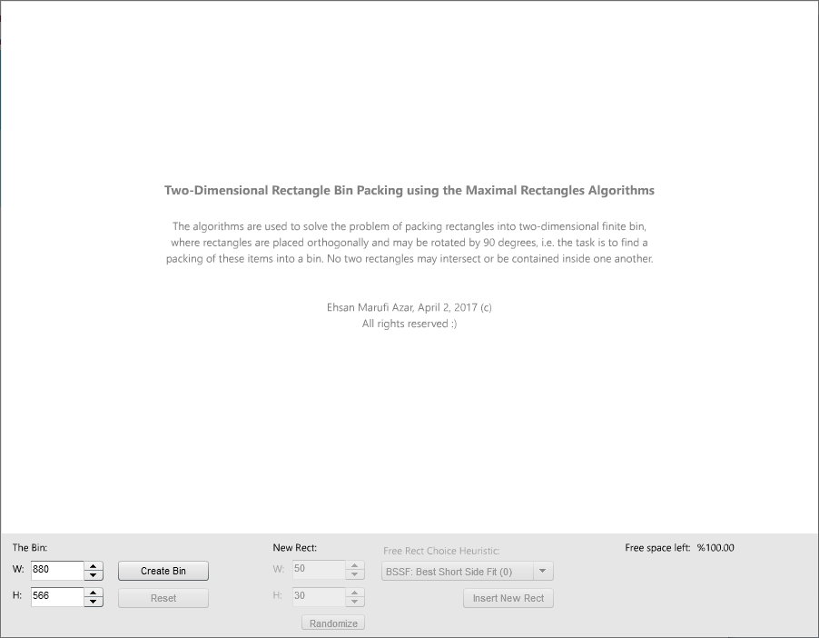

# Rectangle Bin Pack (AS3)
Packing a set of 2D rectangles into a larger bin

The code can be used to solve the problem of packing a set of 2D rectangles into a larger bin. The 
algorithms are all approximations and use various heuristics, since the problem itself is intractable.

The Maximal Rectangles Algorithms are used to solve the problem of packing rectangles into two-dimensional finite bin, where rectangles are placed orthogonally and may be rotated by 90 degrees, i.e. the task is to find a packing of these items into a bin. No two rectangles may intersect or be contained inside one another. 

All the code is released to Public Domain. Patches and comments are welcome.
It makes me happy to hear if someone finds the algorithms and the implementations useful.

Ehsan Marufi 
April 2017